# S4 System Architecture - Detailed Diagrams

## 📐 System Overview

This document contains comprehensive architecture diagrams for the S4 Remote Robot Management System using Mermaid notation.

---

## 1. System Block Diagram

```mermaid
graph TB
    subgraph "Webots Simulation Environment"
        Robot[🤖 TurtleBot3/E-puck Robot]
        Controller[Python Controller<br/>controller.py]
        World[World File<br/>robot_world.wbt]
        Robot --> Controller
        World --> Robot
    end
    
    subgraph "Cloud Backend - Node.js"
        WSServer[WebSocket Server<br/>ws://localhost:3000]
        Router[WS Router<br/>Message Handler]
        Logger[Telemetry Logger<br/>Path History]
        REST[REST API<br/>/status endpoint]
        
        WSServer --> Router
        Router --> Logger
        WSServer --> REST
    end
    
    subgraph "Cloud Frontend - React"
        Dashboard[React Dashboard<br/>http://localhost:5173]
        WSClient[WebSocket Client<br/>websocket.js]
        Telemetry[Telemetry Panel]
        Controls[Control Panel]
        Path[Path Visualization]
        Logs[Live Logs]
        
        Dashboard --> WSClient
        Dashboard --> Telemetry
        Dashboard --> Controls
        Dashboard --> Path
        Dashboard --> Logs
    end
    
    Controller -->|Telemetry<br/>200-300ms| WSServer
    WSServer -->|Broadcast| WSClient
    WSClient -->|Commands| WSServer
    WSServer -->|Forward| Controller
    
    style Robot fill:#90EE90
    style Controller fill:#87CEEB
    style WSServer fill:#FFD700
    style Dashboard fill:#FF69B4
```



---

## 2. Telemetry Flow Sequence Diagram

```mermaid
sequenceDiagram
    participant Robot as 🤖 Webots Robot
    participant Controller as Python Controller
    participant Backend as Node.js Backend
    participant Frontend as React Frontend
    participant User as 👤 User
    
    Note over Robot,Controller: Every 200-300ms
    
    Robot->>Controller: Read sensors<br/>(position, speed, battery)
    Controller->>Controller: Calculate pose (x, y, θ)
    Controller->>Controller: Format telemetry JSON
    
    Controller->>Backend: WebSocket: telemetry message
    Note right of Backend: {"type": "telemetry",<br/>"pose": {...},<br/>"speed": 0.3,<br/>"battery": 92.5}
    
    Backend->>Backend: Log telemetry
    Backend->>Backend: Store in path history
    Backend->>Backend: Broadcast to all clients
    
    Backend->>Frontend: WebSocket: forward telemetry
    
    Frontend->>Frontend: Update state
    Frontend->>Frontend: Render telemetry panel
    Frontend->>Frontend: Update path visualization
    Frontend->>Frontend: Add log entry
    
    Frontend->>User: Display updated UI
    
    Note over Robot,User: Cycle repeats continuously
```



---

## 3. Tele-Operation Command Flow Sequence Diagram

```mermaid
sequenceDiagram
    participant User as 👤 User
    participant UI as React UI
    participant WSClient as WebSocket Client
    participant Backend as Node.js Backend
    participant Controller as Python Controller
    participant Robot as 🤖 Webots Robot
    
    User->>UI: Click "Forward" button
    UI->>UI: Validate connection
    UI->>WSClient: Send command
    
    WSClient->>Backend: WebSocket: cmd message
    Note right of Backend: {"type": "cmd",<br/>"cmd": "forward"}
    
    Backend->>Backend: Log command
    Backend->>Backend: Route to robot client
    
    Backend->>Controller: WebSocket: forward command
    
    Controller->>Controller: Parse command
    Controller->>Controller: Map to motor speeds
    Note left of Controller: forward → left: 2.0, right: 2.0
    
    Controller->>Robot: Set motor velocities
    Robot->>Robot: Apply physics
    Robot->>Robot: Update position
    
    Note over Robot,User: Robot moves in simulation
    
    Robot->>Controller: Read new position
    Controller->>Backend: Send updated telemetry
    Backend->>WSClient: Broadcast new position
    WSClient->>UI: Update display
    UI->>User: Show robot moved
```



---

## 4. Data Flow Diagram


---

## 5. Component Interaction Diagram


---

## 6. WebSocket Message Protocol

```mermaid
graph LR
    subgraph "Telemetry Messages"
        T1[type: 'telemetry']
        T2[pose: {x, y, theta}]
        T3[speed: number]
        T4[battery: number]
        T5[cycle: number]
        T6[timestamp: number]
    end
    
    subgraph "Command Messages"
        C1[type: 'cmd']
        C2[cmd: string]
    end
    
    subgraph "Command Types"
        CT1[forward]
        CT2[backward]
        CT3[left]
        CT4[right]
        CT5[stop]
    end
    
    T1 --> T2
    T2 --> T3
    T3 --> T4
    T4 --> T5
    T5 --> T6
    
    C1 --> C2
    C2 --> CT1
    C2 --> CT2
    C2 --> CT3
    C2 --> CT4
    C2 --> CT5
    
    style T1 fill:#90EE90
    style C1 fill:#87CEEB
```

---

## 7. State Machine - Robot Control


---

## 8. Deployment Architecture


---

## 9. Data Schema

### Telemetry Data Structure


---

## 10. System Timing Diagram


---

## Technical Specifications

### Communication Protocol

| Parameter | Value |
|-----------|-------|
| Protocol | WebSocket (RFC 6455) |
| Message Format | JSON |
| Telemetry Rate | 4-5 Hz (200-300ms) |
| Port | 3000 |
| Encoding | UTF-8 |

### Robot Specifications (Simulation)

| Parameter | Value |
|-----------|-------|
| Robot Type | TurtleBot3 Burger / E-puck |
| Max Speed | 0.5 m/s |
| Wheel Base | 0.16 m (TurtleBot3) |
| Weight | ~1 kg (simulated) |
| Battery | 100% → 0% (linear drain) |

### Performance Metrics

| Metric | Target | Actual |
|--------|--------|--------|
| Telemetry Latency | < 200ms | ~140ms |
| Command Response | < 100ms | ~50ms |
| WebSocket Reconnect | < 3s | ~2s |
| Frontend FPS | 60 fps | 60 fps |
| Max Concurrent Clients | 100+ | Untested |

---

## Network Architecture


---

## Security Considerations (Future)


---

## Error Handling Flow


---

## Summary

This S4 architecture demonstrates:

✅ **Scalable WebSocket-based communication**  
✅ **Real-time bidirectional data flow**  
✅ **Modular component design**  
✅ **Clear separation of concerns**  
✅ **Extensible for future enhancements**  

All diagrams are rendered using Mermaid and can be viewed in any Markdown viewer that supports Mermaid syntax.
