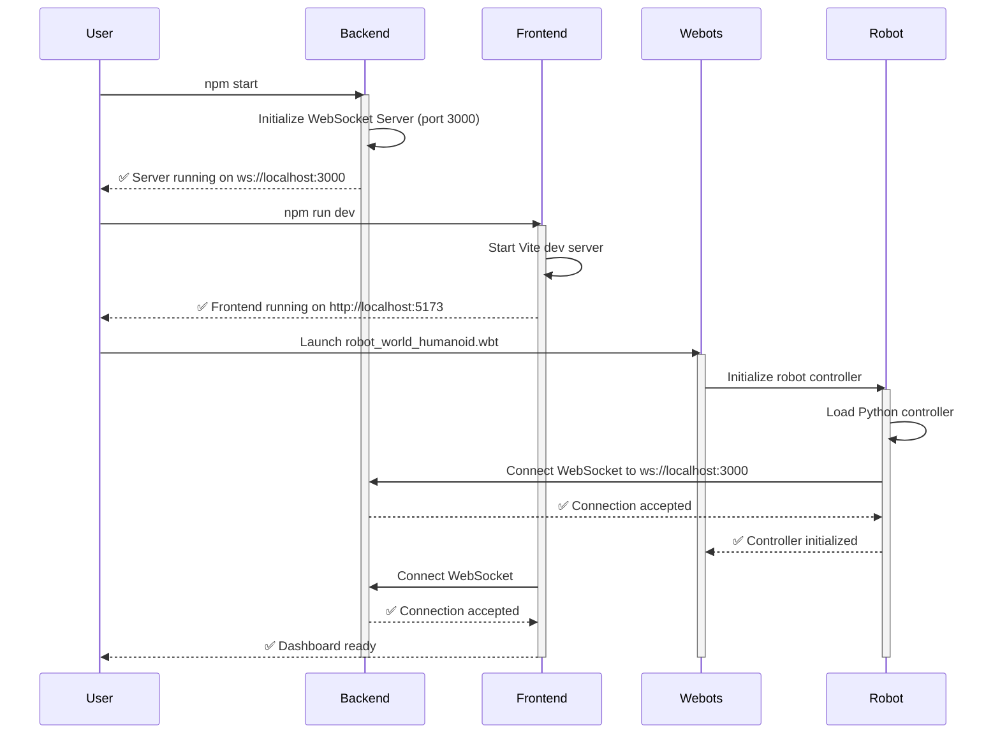
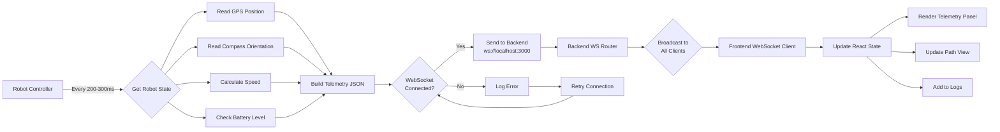
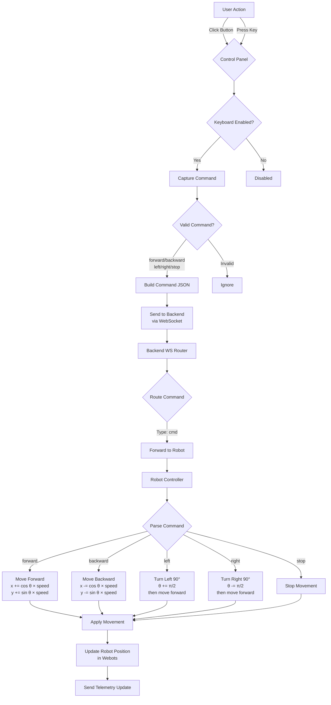
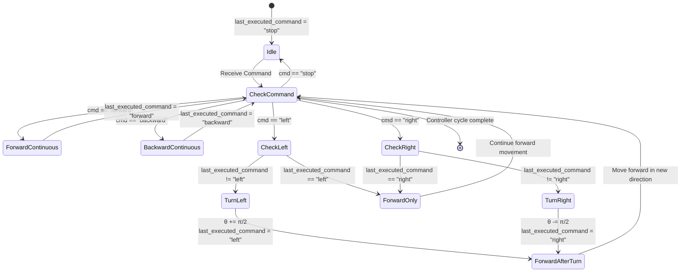
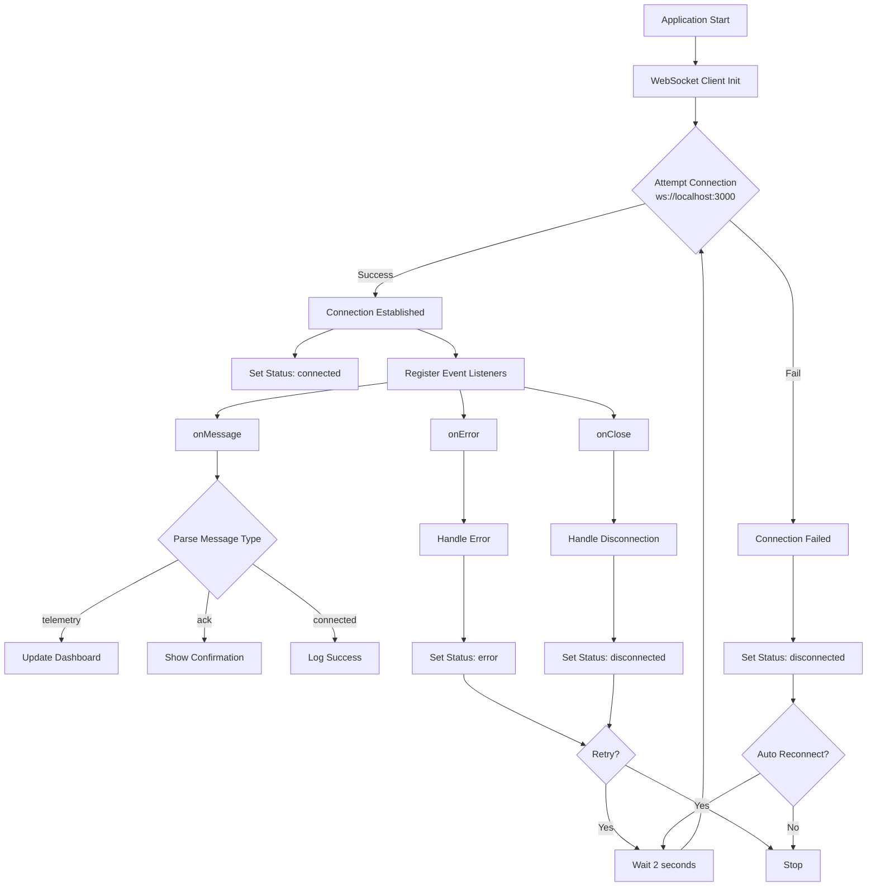
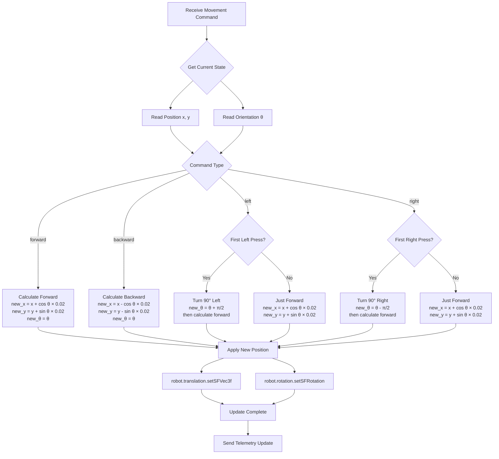
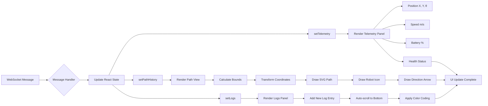
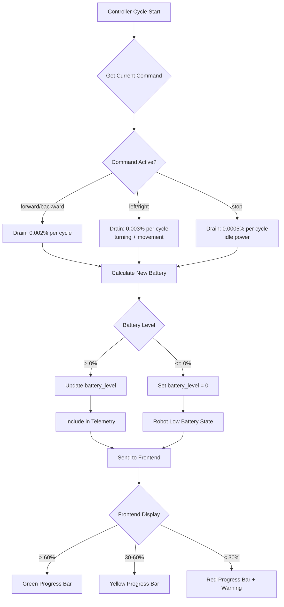
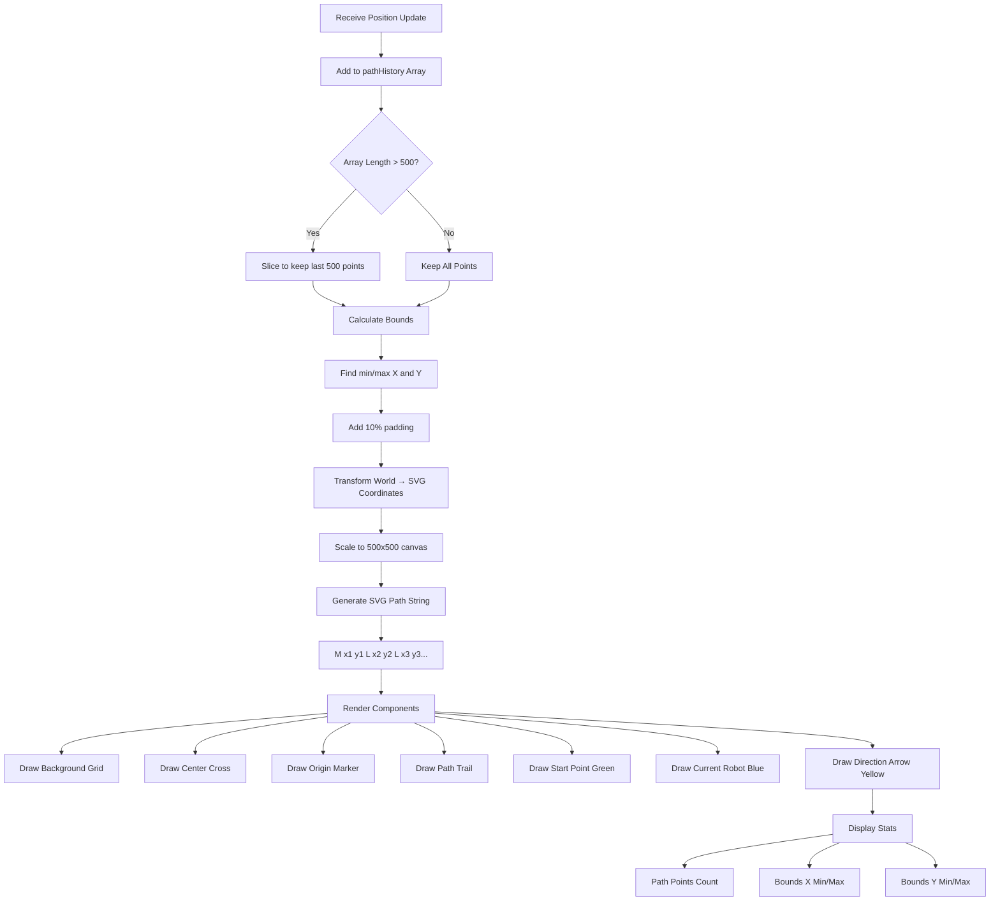
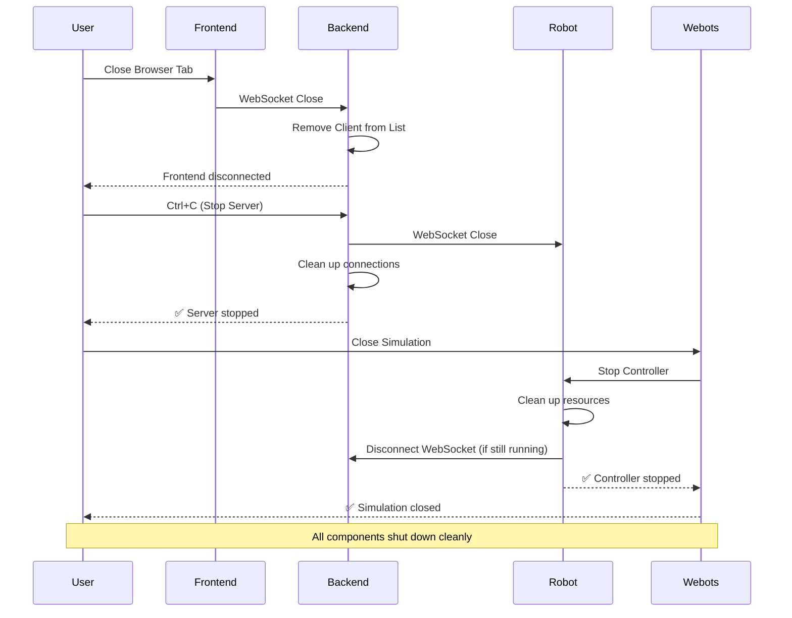

# Function Flow Diagrams - S4 System

## Fitfest25 Hackathon

---

## 📊 1. System Startup Flow

---

## 📡 2. Telemetry Flow (Robot → Frontend)

---

## 🎮 3. Command Flow (Frontend → Robot)

---

## 🔄 4. Command Debouncing Flow

---

## 🔌 5. WebSocket Connection Management

---

## 🧮 6. Movement Kinematics Flow

---

## 🖼️ 7. Frontend Rendering Flow

---

## 🔋 8. Battery Drain Simulation

---

## 🎯 9. Path Visualization Algorithm

---

## 📦 10. System Shutdown Flow

---

**Last Updated**: December 1, 2025  
**Project**: S4 Remote Robot Management System  
**Event**: Fitfest25 Hackathon
